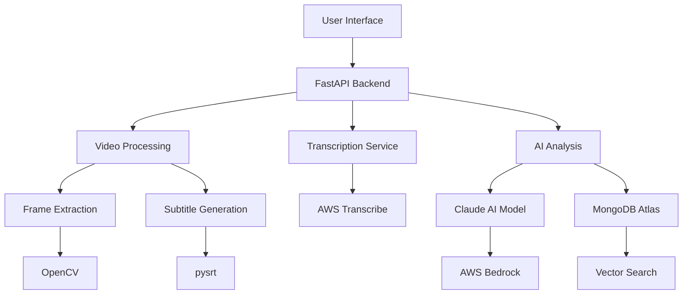

# VisualAIze

## Table of Contents
1. [Overview](#1-overview)
2. [System Architecture](#2-system-architecture)
3. [Components](#3-components)
4. [Installation & Deployment](#4-installation--deployment)
5. [Configuration](#5-configuration)
6. [Usage](#6-usage)
7. [API Reference](#7-api-reference)
8. [Security Considerations](#8-security-considerations)
9. [Monitoring & Logging](#9-monitoring--logging)
10. [Troubleshooting](#10-troubleshooting)
11. [Development Guide](#11-development-guide)
12. [Maintenance & Operations](#12-maintenance--operations)

### 1. Overview

VisualAIze is an advanced video analysis and interaction platform that combines video processing, transcription, summarization, and AI-powered question answering. It allows users to upload videos, process them for detailed analysis, and interact with the content through a user-friendly interface.

Key features:
- Video upload and processing
- Automated transcription and subtitle generation
- Video summarization using AI
- Frame-by-frame analysis with computer vision
- Interactive Q&A system based on video content
- Web-based user interface for easy access and interaction

### 2. System Architecture



### 3. Components

1. User Interface
   - Purpose: Provide web-based access to video processing and Q&A features
   - Technologies: HTML, CSS, JavaScript, Gradio
   - Interactions: Communicates with FastAPI backend

2. FastAPI Backend
   - Purpose: Handle HTTP requests, manage application logic
   - Technologies: Python, FastAPI
   - Interactions: Coordinates between UI and processing services

3. Video Processing
   - Purpose: Extract frames, generate subtitles
   - Technologies: OpenCV, pysrt
   - Interactions: Processes uploaded videos

4. Transcription Service
   - Purpose: Generate text transcripts from video audio
   - Technologies: AWS Transcribe
   - Interactions: Sends audio to AWS, receives transcripts

5. AI Analysis
   - Purpose: Summarize content, analyze frames, answer questions
   - Technologies: Claude AI (via AWS Bedrock), MongoDB Atlas
   - Interactions: Processes text and images, stores/retrieves data

### 4. Installation & Deployment

1. Clone the repository
2. Install dependencies: `pip install -r requirements.txt`
3. Set up AWS credentials for S3, Transcribe, and Bedrock access
4. Configure MongoDB Atlas connection
5. Run the application: `python main.py`

### 5. Configuration

Environment variables (store in `.env` file):
- `AWS_REGION`: AWS region for services (e.g., "us-east-1")
- `BUCKET_NAME`: S3 bucket for video storage
- `MONGODB_URI`: Connection string for MongoDB Atlas

### 6. Usage

1. Access the web interface at `http://localhost:8000`
2. Use the "Video Processing" tab to upload and analyze videos
3. Use the "Ask Me" tab to interact with processed video content

### 7. API Reference

- `/`: Serves the main HTML interface
- `/ask_me`: Mounts the Q&A Gradio interface
- `/video_processing`: Mounts the video processing Gradio interface

### 8. Security Considerations

- Implement user authentication for access control
- Use HTTPS for all communications
- Regularly update dependencies and apply security patches
- Implement rate limiting to prevent abuse

### 9. Monitoring & Logging

- Use AWS CloudWatch for monitoring AWS services
- Implement application-level logging in FastAPI
- Monitor MongoDB Atlas performance and usage

### 10. Troubleshooting

Common issues:
- Video upload failures: Check S3 permissions and network connectivity
- Transcription errors: Verify AWS Transcribe service status
- AI analysis timeouts: Check AWS Bedrock quotas and limits

### 11. Development Guide

### Codebase Organization

The VisualAIze project is structured as follows:

- `main.py`: Entry point of the application, sets up FastAPI and Gradio interfaces.
- `ui_askme.py`: Contains the Gradio interface for the "Ask Me" functionality.
- `ui_vp.py`: Implements the video processing interface using Gradio.
- `mongodb_atlas_retriever_tools.py`: Provides tools for interacting with MongoDB Atlas.
- `requirements.txt`: Lists all Python dependencies for the project.
- `static/`: Directory containing static assets (CSS, JS).
- `templates/`: Directory for HTML templates.

Key files and their purposes:

- `main.py`: Initializes the FastAPI application, mounts static files, and sets up routes.
- `ui_askme.py`: Implements the chatbot interface for asking questions about processed videos.
- `ui_vp.py`: Handles video upload, processing, transcription, and analysis.
- `mongodb_atlas_retriever_tools.py`: Provides functionality for hybrid search in MongoDB Atlas.

### Development Environment Setup

1. Clone the repository and navigate to the project directory.

2. Create a virtual environment:
   ```
   python -m venv venv
   source venv/bin/activate  # On Windows: venv\Scripts\activate
   ```

3. Install dependencies:
   ```
   pip install -r requirements.txt
   ```

4. Set up environment variables:
   Create a `.env` file in the project root with the following variables:
   ```
   MONGODB_URI=your_mongodb_uri
   AWS_REGION=your_aws_region
   BUCKET_NAME=your_s3_bucket_name
   ```

5. Ensure you have necessary AWS credentials configured for accessing Bedrock and S3 services.

### Testing and Debugging

- To run the application locally:
  ```
  python main.py
  ```
  This will start the FastAPI server with Gradio interfaces mounted.

- For debugging, use print statements or logging in critical sections of the code.
- Test individual components (e.g., MongoDB connection, AWS services) separately before integration.


### 12. Maintenance & Operations

### Scheduled Backups

- Implement regular backups of the MongoDB database:
  - Use MongoDB Atlas backup features for automated, scheduled backups.
  - Store backup files in a secure, separate location (e.g., different AWS region).

- Backup static assets and configuration files:
  - Set up automated S3 bucket replication for redundancy.
  - Include local backups of critical configuration files and environment variables.

### Regular Updates and Patches

- Keep dependencies updated:
  - Regularly review and update `requirements.txt`.
  - Test thoroughly after updating any dependencies.

- Stay informed about security patches for:
  - Python
  - FastAPI
  - Gradio
  - MongoDB
  - AWS services used (Bedrock, S3, Transcribe)

- Implement a staging environment to test updates before deploying to production.

### Monitoring System Health

- Set up AWS CloudWatch for monitoring AWS services:
  - Configure alarms for S3 bucket capacity and access patterns.
  - Monitor Bedrock API usage and quotas.

- Implement application-level logging:
  - Use Python's logging module to track application events.
  - Consider integrating with a centralized logging service for easier analysis.

- Monitor MongoDB Atlas:
  - Set up alerts for database performance, capacity, and error rates.
  - Regularly review database logs for any anomalies.

- Performance monitoring:
  - Use tools like Datadog to monitor application performance.
  - Pay special attention to video processing times and resource usage.

This documentation provides a comprehensive overview of the VisualAIze application, covering its architecture, components, setup, and usage. For detailed implementation specifics, refer to the individual source code files and comments within.